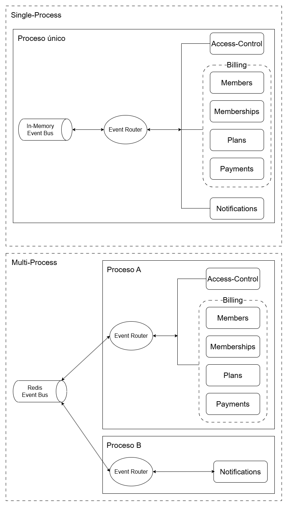

# 🧱 NestJS Microservices-Ready Monolith Example

## NestJS Data-Centric Event-Driven — Gym Management API

## 📖 Resumen del Proyecto

Este proyecto es una API REST desarrollada con **NestJS** siguiendo los
principios de un **Monolito Modular Event-Driven con Kernel de Eventos**.

El objetivo es demostrar:

- Desarrollo rápido como monolito
- Event bus intercambiable (InMemory / Redis)
- Comunicación entre módulos vía eventos tipados (fire-and-forget)
- Contratos de eventos centralizados
- Documentación automática con Swagger
- Validación de configuración con Zod

La aplicación gestiona:

- Miembros de un gimnasio
- Planes de membresía
- Membresías (asignación miembro ↔ plan)
- Pagos
- Notificaciones automáticas (vía eventos)
- Control de acceso

---

# 🏗️ Arquitectura

El proyecto está organizado en módulos autónomos con un kernel de eventos compartido. El módulo `billing` actúa como agrupador de los sub-módulos de negocio principales:

    src/
     ├── modules/
     │    ├── billing/                → Módulo agrupador de facturación
     │    │    ├── billing.module.ts
     │    │    ├── members/           → Gestión de miembros
     │    │    │    ├── dto/
     │    │    │    └── mappers/
     │    │    ├── plans/             → Planes de membresía
     │    │    │    ├── dto/
     │    │    │    └── mappers/
     │    │    ├── memberships/       → Asignación miembro-plan
     │    │    │    ├── dto/
     │    │    │    └── mappers/
     │    │    └── payments/          → Procesamiento de pagos
     │    │         ├── dto/
     │    │         └── mappers/
     │    ├── notifications/          → Notificaciones automáticas (listener)
     │    └── access-control/         → Registro de accesos
     │         └── dto/
     ├── shared/
     │    ├── dto/                    → DTOs compartidos (IdResponseDto)
     │    └── events/
     │         ├── domain/            → EventBus (contrato) y EventContracts
     │         ├── application/       → EventRouter
     │         └── infrastructure/    → InMemoryEventBus, RedisEventBus
     ├── app.module.ts
     ├── config.ts
     └── main.ts

### Diagrama de arquitectura



### Topologías posibles

El `EventRouter` permite cambiar la infraestructura del bus por evento, habilitando distintas topologías de despliegue **sin modificar el código de negocio**:

- **Single-Process** — Todos los módulos corren en un único proceso. El `EventRouter` usa `InMemoryEventBus` para todos los eventos. Ideal para desarrollo y despliegues simples.

- **Multi-Process** — Los módulos se pueden separar en procesos independientes. Por ejemplo, `Notifications` puede correr como un servicio aparte comunicándose vía `RedisEventBus`, mientras los módulos del proceso principal siguen usando `InMemoryEventBus` internamente.

### Principios aplicados

- Cada módulo es autónomo y aislado
- `BillingModule` agrupa los sub-módulos de negocio (Members, Plans, Memberships, Payments) y registra todas sus entidades, controllers y services
- La comunicación entre módulos independientes es vía `EventRouter` (fire-and-forget)
- Los sub-módulos dentro de `billing` comparten repositorios directamente a través de `TypeOrmModule.forFeature`
- Los contratos de eventos están tipados centralmente en `EventContractMap`
- La infraestructura del bus es intercambiable (`InMemoryEventBus` / `RedisEventBus`)
- La configuración de entorno se valida con Zod al iniciar
- Cada sub-módulo tiene sus propios **mappers** (entity → DTO) y **DTOs** de entrada/salida

---

# 🧠 Entidades de Dominio

## 🟢 Member

- `id: string` (UUID)
- `firstName: string`
- `lastName: string`
- `email: string` (unique)
- `active: boolean` (default: `true`)
- `createdAt: Date`
- `updatedAt: Date`

---

## 🔵 Plan

- `id: string` (UUID)
- `name: string`
- `durationDays: number`
- `price: number` (decimal, precision 10, scale 2)
- `description?: string`
- `active: boolean` (default: `true`)

---

## 🟣 Membership

- `id: string` (UUID)
- `memberId: string` (UUID)
- `planId: string` (UUID)
- `startDate: Date`
- `endDate: Date` (calculada automáticamente)
- `active: boolean` (default: `false`)
- `createdAt: Date`
- `updatedAt: Date`

### Reglas importantes:

- La fecha de fin se calcula como `startDate + plan.durationDays`
- Al crearse, valida que el miembro y el plan existan (acceso directo a repositorios)
- Al crearse, emite evento `MEMBERSHIP_CREATED`

---

## 🟡 Payment

- `id: string` (UUID)
- `membershipId: string` (UUID)
- `memberId: string` (UUID)
- `amount: number` (decimal, precision 10, scale 2)
- `completed: boolean` (default: `false`)
- `createdAt: Date`
- `updatedAt: Date`

### Reglas importantes:

- Valida que la membresía exista antes de registrar el pago (acceso directo a repositorio)
- Al completarse, emite evento `PAYMENT_COMPLETED`

---

## 🟠 Notification

- `id: string` (UUID)
- `memberId: string`
- `type: NotificationType` (`membership_assigned` | `payment_completed`)
- `message: string`
- `sent: boolean` (default: `false`)
- `createdAt: Date`

### Reglas importantes:

- Se genera automáticamente al escuchar eventos `MEMBERSHIP_CREATED` y `PAYMENT_COMPLETED`
- No tiene controller propio (solo reacciona a eventos vía `NotificationsListener`)

---

## 🔴 AccessLog

- `id: string` (UUID)
- `memberId: string`
- `membershipId: string`
- `granted: boolean` (default: `true`)
- `createdAt: Date`

---

# ⚙️ Flujo de Eventos

El sistema utiliza eventos **fire-and-forget** para comunicación entre módulos independientes. Los contratos están definidos en `EmitContractMap`.

## 📤 Eventos Emitidos

### 1️⃣ MEMBERSHIP_CREATED

Emitido al crear una membresía.

**Payload:**

```typescript
{
  planName: string;
  durationDays: number;
  memberId: string;
}
```

**Escuchado por:** `NotificationsListener` → crea notificación de tipo `membership_assigned`

### 2️⃣ PAYMENT_COMPLETED

Emitido al completar un pago.

**Payload:**

```typescript
{
  membershipId: string;
  amount: number;
  memberId: string;
}
```

**Escuchado por:** `NotificationsListener` → crea notificación de tipo `payment_completed`

---

# 🌐 Endpoints

Swagger disponible en:

http://localhost:{PORT}/api

---

# 🟢 Members

## POST /members

Crea un nuevo miembro.

```json
{
  "firstName": "Juan",
  "lastName": "Pérez",
  "email": "juan@example.com"
}
```

**Respuesta:** `{ "id": "uuid" }`

## GET /members

Lista todos los miembros.

## GET /members/:id

Obtiene un miembro por ID.

## GET /members/:id/payments

Obtiene los pagos del miembro (acceso directo al repositorio de payments).

## GET /members/:id/memberships

Obtiene las membresías del miembro (acceso directo al repositorio de memberships).

## PATCH /members/:id

Actualiza un miembro.

```json
{
  "firstName": "Nuevo Nombre",
  "lastName": "Nuevo Apellido",
  "active": false
}
```

**Respuesta:** `{ "id": "uuid" }`

---

# 🔵 Plans

## POST /plans

Crea un nuevo plan.

```json
{
  "name": "Plan Mensual",
  "durationDays": 30,
  "price": 5000,
  "description": "Acceso completo por 30 días"
}
```

**Respuesta:** `{ "id": "uuid" }`

## GET /plans

Lista todos los planes.

## GET /plans/:id

Obtiene un plan por ID.

## PATCH /plans/:id

Actualiza un plan.

```json
{
  "name": "Plan Actualizado",
  "price": 6000
}
```

**Respuesta:** `{ "id": "uuid" }`

## DELETE /plans/:id

Desactiva el plan (soft delete).

---

# 🟣 Memberships

## POST /memberships

Crea una nueva membresía.

```json
{
  "memberId": "uuid",
  "planId": "uuid",
  "startDate": "2026-03-01"
}
```

Valida que el miembro y el plan existan. Calcula `endDate` automáticamente. Emite evento `MEMBERSHIP_CREATED`.

**Respuesta:** `{ "id": "uuid" }`

---

# 🟡 Payments

## POST /payments

Registra un pago para una membresía.

```json
{
  "membershipId": "uuid",
  "amount": 5000
}
```

Valida que la membresía exista. Emite `PAYMENT_COMPLETED` al completarse.

**Respuesta:** `{ "id": "uuid" }`

---

# 🔴 Access Control

## POST /access-control

Registra un intento de acceso.

```json
{
  "memberId": "uuid",
  "membershipId": "uuid",
  "granted": true
}
```

**Respuesta:** `{ "id": "uuid" }`

---

# 🔐 Variables de Entorno

Validadas con **Zod** al iniciar la aplicación:

    PORT=<PORT>                   # default: 3000
    DB_HOST=<HOST>
    DB_PORT=<PORT>                # default: 5432
    DB_USERNAME=<USERNAME>
    DB_PASSWORD=<PASSWORD>
    DB_NAME=<DB_NAME>
    DB_SYNCHRONIZE=<true|false>   # default: false
    DB_LOGGING=<true|false>       # default: false
    REDIS_URL=<URL>               # requerido (URL válida)

Se incluye un `.env.example` en el repositorio.

---

# 🚀 Guía de Ejecución en Local

## 1️⃣ Clonar el repositorio

    git clone <repo-url>
    cd microservices-ready-monolith

## 2️⃣ Instalar dependencias

    npm install

## 3️⃣ Crear base de datos

    CREATE DATABASE <DB_NAME>;

## 4️⃣ Configurar variables de entorno

    cp .env.example .env
    # Editar .env con tus valores

## 5️⃣ Ejecutar proyecto

    npm run start:monolith

## 6️⃣ Acceder a Swagger

http://localhost:{PORT}/api

---

# 📦 Tecnologías Utilizadas

- **NestJS** — Framework principal
- **TypeORM** — ORM para PostgreSQL
- **PostgreSQL** — Base de datos relacional
- **Redis** (ioredis) — Bus de eventos alternativo
- **Swagger** (@nestjs/swagger) — Documentación automática de API
- **Zod** — Validación de variables de entorno
- **class-validator / class-transformer** — Validación de DTOs
- **@nestjs/event-emitter** — Event bus in-memory
